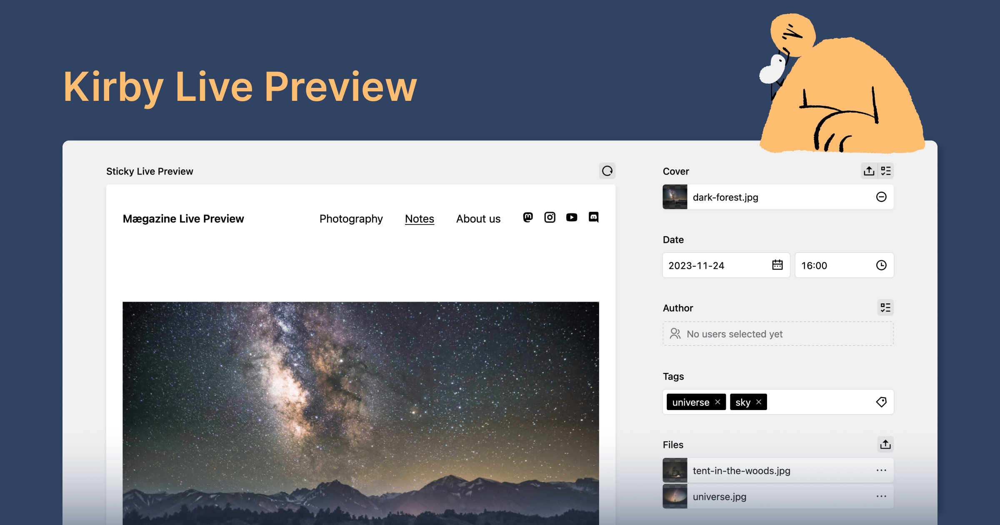

[](https://kirby.tools/live-preview)

# Kirby Live Preview

Kirby Live Preview is a plugin for [Kirby CMS](https://getkirby.com) that adds a Panel section to render any page in an iframe – content updates as editors type, unsaved changes included. Navigate by clicking links inside the preview – the matching Panel view opens instead of the linked page. Pin the section sticky to keep it visible while editing blocks and other fields side-by-side.

## Features

- 🖥️ **Renders as You Type**: The section refreshes on every change, before anything is saved.
- 📱 **Three Screen Widths**: Toggle the preview to 390, 768 or 1440 pixels wide; where the section is narrower, the page is scaled down.
- 🔍 **Preview Mode**: The rendered page carries a preview-mode attribute on its `html` element and a `previewMode()` method in PHP, so it can hide the cookie banner or skip animations.
- 🔗 **Links Open Panel Pages**: A click on a link inside the preview opens the linked page in the Panel; links to other sites open in a new tab.

## Licensing

Kirby Live Preview is a commercial plugin that requires a license. You can install and test the plugin locally without a license. However, production environments require a valid license. You can purchase a license from the [Kirby Live Preview Website](https://kirby.tools/live-preview/buy).

## Requirements

- Kirby 4 or Kirby 5

## Installation

### Composer (Recommended)

```bash
composer require johannschopplich/kirby-live-preview
```

### Manual Installation

Download and copy this repository to `/site/plugins/kirby-live-preview`.

## Documentation

For installation, configuration, and usage, see the [Kirby Live Preview documentation](https://kirby.tools/docs/live-preview).

## Support and Questions

We are committed to support you if you have any questions or issues with Kirby Live Preview. There are several ways to get support:

- **GitHub Discussions**: Join the community and engage in discussions on our [GitHub Discussions page](https://github.com/kirby-tools/community/discussions).
- **Email Support**: You can ask questions and seek assistance by emailing us at [hello@kirby.tools](mailto:hello@kirby.tools). Please use the GitHub discussions if you have a general question or comment about Kirby Live Preview.
- **GitHub Issues**: For reporting bugs or requesting new features, please use the [GitHub Issues page](https://github.com/kirby-tools/community/issues).

We encourage you to use the resources above to connect with us and other users of Kirby Live Preview.

For the sake of reproducible bug reports, please include the following information in your bug reports:

- Kirby & Kirby Live Preview version
- Browser environment (name, version, operating system)
- Global and section configuration (without any sensitive information)
- Steps to reproduce the bug (if no reproduction is provided)
- Screenshots or screen recordings if applicable

## Feedback

We value your feedback and ideas for improving Kirby Live Preview. If you have any suggestions, please feel free to reach out to us via email or preferably by creating a new discussion on our [GitHub Discussions page](https://github.com/kirby-tools/community/discussions).

## License

[Kirby Tools License](./LICENSE.md) © 2024-PRESENT [Johann Schopplich](https://github.com/johannschopplich)
