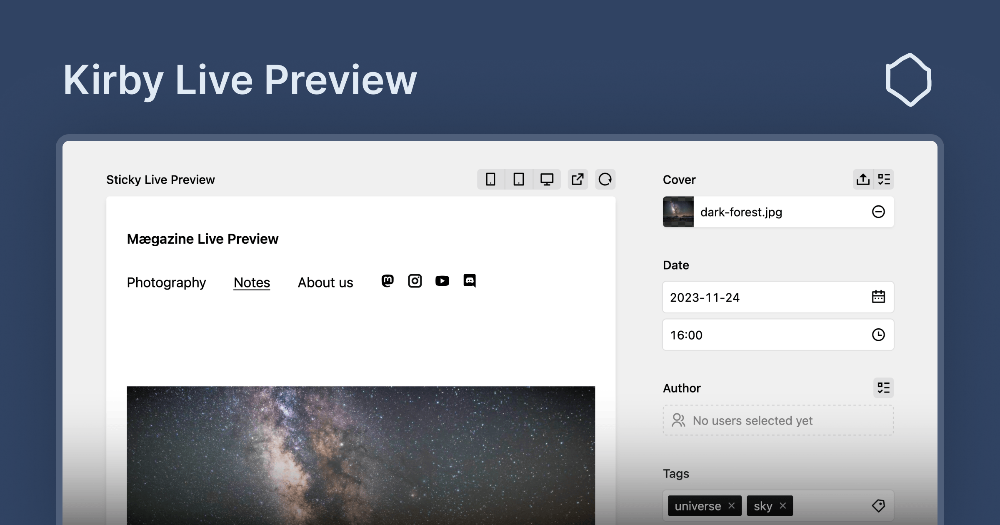

# Kirby Live Preview

The Live Preview Panel section renders your content in real-time as you type. It provides a live preview with unsaved changes, allowing you to see how your content will look before saving it. The Live Preview Panel is a powerful tool for content creators, editors, and developers.

## Licensing

Kirby Live Preview is a commercial plugin that requires a license. You can install and test the plugin locally without a license. However, production environments require a valid license. You can purchase a license from the [Kirby Tools Website](https://kirby.tools/live-preview).

## Getting Started

To get started, please refer to the [documentation](https://kirby.tools/docs/live-preview) for guidance on installation, configuration, and usage.

## Support and Questions

We are committed to support you if you have any questions or issues with Kirby Live Preview. There are several ways to get support:

- **GitHub Discussions**: Join the community and engage in discussions on our [GitHub Discussions page](https://github.com/kirby-tools/community/discussions).
- **Email Support**: You can ask questions and seek assistance by emailing us at [hello@kirby.tools](mailto:hello@kirby.tools). Please use the GitHub discussions if you have a general question or comment about Kirby Live Preview.
- **GitHub Issues**: For reporting bugs or requesting new features, please use the [GitHub Issues page](https://github.com/kirby-tools/community/issues).

We encourage you to use the resources above to connect with us and other users of Kirby Live Preview.

For the sake of reproducible bug reports, please include the following information in your bug reports:

- Kirby & Kirby Live Preview version
- Browser environment (name, version, operating system)
- Global and section configuration (without any sensitive information)
- Steps to reproduce the bug (if no reproduction is provided)
- Screenshots or screen recordings if applicable

## Feedback

We value your feedback and ideas for improving Kirby Live Preview. If you have any suggestions, please feel free to reach out to us via email or preferably by creating a new discussion on our [GitHub Discussions page](https://github.com/kirby-tools/community/discussions).

## License

[Kirby Tools License](./LICENSE.md) License © 2024-PRESENT [Johann Schopplich](https://github.com/johannschopplich)
